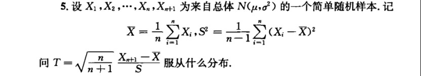

# 2022 秋
1. 题型及分布与往年差不多，这一部分刷刷往年题后基本无问题
2. 这里指出两道问题，分别是第一题和统计量性质的问题

    (1) 第一题题面大概是这样：设有来自三个地区一、二、三的各10名，15名和25名考生的报名表，其中女生的报名表分别为3份，7份和5份。随机地取一个地区的报名表，从中先后抽出两份。已知后抽到的一份是男生表，求先抽到的一份是女生表的概率。

    (2)统计量的问题如下图所示：
    
    

3. 往年试卷的答案中存在个别错误，如果觉得自己是正确的，那可能真的是正确的